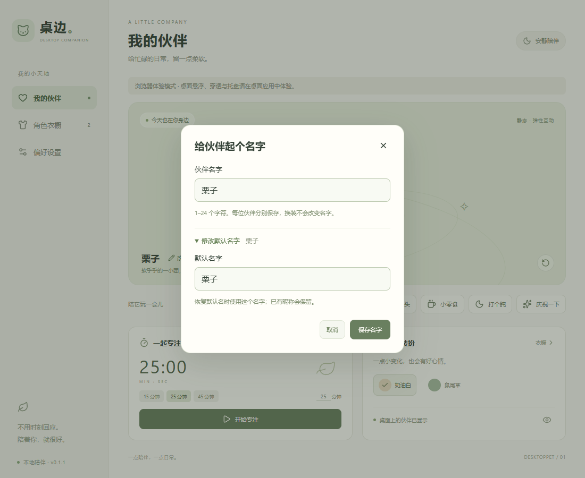

# 桌边 · DesktopPet

一个本地运行、可更换角色的 Windows 桌面伙伴。内置伙伴叫 **啾咪**，是一只头顶嫩芽、软乎乎的小猫。

**最新公开稳定版：v0.9.1。** 在偏好设置选择数据框自动 / 固定左侧 / 固定右侧，单独调整 80%–125% 大小。所在屏幕的前台应用全屏时临时隐藏，退出后恢复；手动隐藏状态仍保留。保留三种数据框样式、低频自动额度查询、悬停控制条、提醒及备份恢复，支持自动检查版本、下载、验签和点击安装更新。内置 AI 聊天与 Live2D 留在后续阶段。

当前 main 源码及示例角色包已采用新默认名「啾咪」，已发布安装包将在下次版本更新时同步。用户自定义昵称和默认名继续保留。



## 直接体验

从 [GitHub Releases](https://github.com/HEART-OF-STONE/DesktopPet/releases/latest) 下载安装包或免安装 ZIP，附件包含 SHA-256 清单与更新签名。面向 Windows x64；安装包仅安装到当前用户，需要 WebView2，缺少时安装程序会尝试联网安装运行时。更新包验签已接入，Windows Authenticode 代码签名、干净系统、多屏和长期运行验收仍在跟进。详见 [运行、演示与分享说明](docs/08-sharing.md)。

打开后会出现管理界面和独立桌宠：

- **我的伙伴**：摸头、零食、休息、庆祝；专注计时支持 1–180 分钟、暂停和继续。
- **角色衣橱**：切换静态/动画角色，或导入自己的 PNG / 角色包。
- **今日装扮**：内置奶油白、鼠尾草两套配色。
- **偏好设置**：宠物大小、置顶、吸附、免打扰、音量、移回主屏、完整备份恢复、开机启动与签名更新。
- **提醒收件箱**：Agent 完成、失败、待确认和余额提醒；未读/全部/需处理筛选，已读切换和清理。免打扰期间也保存已开启的提醒。
- **Agent 看板**：Codex 今日 / 7 天 token、模型分布、任务动态、订阅额度快照；可配置 DeepSeek 余额、预算提醒和 Agent 本地事件接口。详见 [联动使用说明](docs/07-agent-guide.md)。
- **桌宠窗口**：按住角色拖动，右键打开管理界面；下方按钮可打开管理界面或隐藏宠物。
- **系统托盘**：显示宠物、打开桌边、移回主屏、切换免打扰和退出。关闭管理窗口会收回托盘，完全退出请使用托盘菜单。

默认关闭音效。免打扰会关闭互动闲聊气泡和音效，计时完成的视觉提醒仍显示。应用完全退出后不会唤醒系统提醒；重新打开时恢复保存的计时状态。

### 改名与默认名字

在「我的伙伴」名称旁或「角色衣橱」卡片上点击 **改名**：

- **伙伴名字**：修改当前昵称，支持 1–24 个字符，保存时去除首尾空白。
- 展开 **修改默认名字**：设置自己的默认名字。例如默认名设为「年糕」、昵称设为「小年糕」，以后「恢复默认名」会恢复成「年糕」，不会固定回到「啾咪」。
- 尚未设置昵称时，修改默认名字会同步改变当前显示；已有昵称会保留。
- 内置角色和导入角色都能改名，各自保存；换皮肤、切换角色和重启不会清除名字。主页、衣橱、桌宠标签及桌宠窗口标题同步更新。

「啾咪」是内置伙伴的默认名字，你也可以为它起自己的名字。名称设置与素材 ID 分开保存，不会修改原始图片或角色包文件。

## 自定义角色

在「角色衣橱 → 导入角色」选择：

1. **单张 PNG**：自动生成静态角色，推荐使用透明背景。
2. **PNG 序列**：同时选择一个 `pet.json` 和所有帧图片。
3. **PNG 精灵图**：同时选择一个 `pet.json` 和其引用的图片。

可直接试用 [PNG 序列示例](examples/png-sequence/pet.json) 和 [精灵图示例](examples/sprite-sheet/pet.json)：打开相应文件夹，在导入对话框中全选该文件夹的 JSON 与 PNG。

清单协议、限制与皮肤制作见 [角色包说明](docs/04-character-packs.md)。当前不支持 ZIP、GIF 或 Live2D 导入。

## 开发

开发清单与设计记录在 [dev/TODO.md](dev/TODO.md) 和 `dev/docs/`；用户说明在 `docs/`。角色导入仅接收 PNG / JSON，说明和开发文件会被拒绝。发布请执行 `./scripts/package-release.ps1`，脚本只打包程序、接入脚本、三份用户说明及许可声明，不包含 `dev/`、源码、测试、日志或个人配置。开发测试必须使用隔离目录；仅人工合成的测试夹具属于源码，真实账户数据、运行记录与截图不得提交。

本次环境：Windows x64、PowerShell 7、Node 24、Rust stable、Visual Studio C++ 构建工具、WebView2。

```powershell
npm ci
npm run desktop:dev
```

仅调试管理界面可运行 `npm run dev`，打开 `http://127.0.0.1:1420`。浏览器预览不提供系统悬浮、穿透和托盘能力，数据与桌面版分开保存。

```powershell
npm test
npm run build
npm run desktop:check
npm run desktop:build -- --bundles nsis
./scripts/package-release.ps1
```

桌面构建生成 EXE 与 NSIS 安装包，发布脚本生成免安装 ZIP、安装包副本和 SHA-256 清单。`desktop:check` 执行 Rust 测试；`build` 包含 TypeScript 检查与前端构建。`npm run assets` 重新生成原创演示角色，`npm run examples` 生成导入示例。完整流程见 [开发发布说明](dev/docs/07-release-workflow.md)。

本机缺少 Rust 时，已将工具链放入工作区 `.tools/cargo` 和 `.tools/rustup`；`scripts/tauri.mjs` 会优先使用它们，没有修改系统 PATH。其他开发机可使用正常安装的 Rust 工具链。依赖缓存和构建产物不计入源码。

## 数据与备份

桌面版默认数据目录为 `%APPDATA%\com.desktop-pet.companion`：

- `state.json`：偏好、计时和导入图片数据，带协议版本。
- `state.backup.json`：上次保存的副本，主文件无法解析时尝试恢复。
- `position.json`：桌宠最近位置。
- `integrations.json` 与备份：Agent 用量、状态、配置、余额历史和提醒收件箱；不包含聊天正文或 API Key。
- `restore-point.json`：上次恢复之前的角色与偏好，供“撤销上次恢复”使用。
- `release-settings.json`：公开发布仓库及上次手动检查结果。
- `agent-bridge.json`：本机事件接口地址与随机访问令牌，不要分享。DeepSeek 密钥单独保存在 Windows 凭据管理器。

在“偏好设置 → 备份与恢复”导出完整备份 JSON，再在另一台电脑选择此文件、预览并确认恢复。包含角色图片、皮肤、名字和偏好；不包含账户凭据、Agent 历史、收件箱、计时或机器设置。恢复与撤销均保留当前计时和联动数据。旧版仅偏好的导出文件不能作为完整备份导入。原型暂用 JSON；SQLite 与资源独立存储仍在后续计划。开发测试通过 `DESKTOPPET_DATA_DIR` 指定隔离目录。

## 规划与验证

- [当前开发 Todo](dev/TODO.md)
- [产品规划和参考项目分析](dev/docs/01-product-plan.md)
- [技术架构与当前实现差异](dev/docs/02-architecture.md)
- [开发路线和任务状态](dev/docs/03-roadmap.md)
- [角色包协议及示例](docs/04-character-packs.md)
- [本次实现、验证结果和待验证项](dev/docs/05-implementation-status.md)
- [Agent 联动计划与完成范围](dev/docs/06-agent-integration.md)
- [Codex / DeepSeek / 本地事件接口使用说明](docs/07-agent-guide.md)：Codex 日志已通过本机只读验证；DeepSeek 真实账户需配置密钥后核验。

参考项目 [DeepSeek-Balance-Whale-Widget](https://github.com/MeteorNOX/DeepSeek-Balance-Whale-Widget) 的角色主要使用静态 PNG 加 CSS 变形。此项目的代码和演示猫「啾咪」重新实现，未复制参考项目角色图片；啾咪可由仓库内脚本完整再生成。名称与演示形象均可后续替换。

## 许可与致谢

本项目自行实现的代码、文档和脚本生成的演示素材使用 [MIT](LICENSE)。感谢
[MeteorNOX / DeepSeek-Balance-Whale-Widget](https://github.com/MeteorNOX/DeepSeek-Balance-Whale-Widget)
提供的交互与用量展示思路，保留其代码版权与 MIT 声明。上游美术、动图和音效不在
MIT 授权范围内，本项目不分发这些资源。

感谢 React、Tauri、Lucide 及其他依赖的贡献者。依赖与素材范围见
[第三方声明](THIRD_PARTY_NOTICES.md)，完整版本和许可见 [依赖许可清单](THIRD_PARTY_LICENSES.txt)。
用户导入的角色仍需自行确认分发权。

源码仓库：[HEART-OF-STONE/DesktopPet](https://github.com/HEART-OF-STONE/DesktopPet)。
公开前检查见 [开源审查记录](dev/open-source-review.md)。开发进度与正式 Release 验收分别记录，
源码版本号不代表该版本已经发布。
