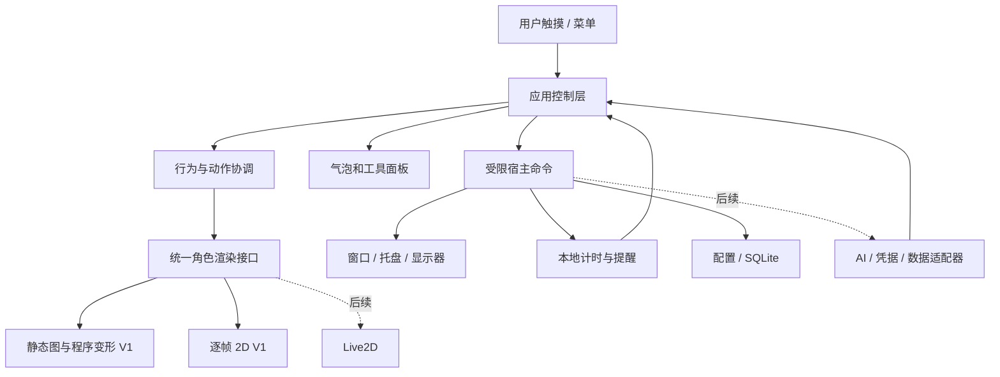

# 技术架构与关键验证

状态：已按 Tauri 2 + React + TypeScript 建立 v0.1.0 可运行原型；本文保留 V1 目标架构，未完成部分不代表现有功能。实际协议见 [角色包说明](../../docs/04-character-packs.md)，测试证据见 `05-implementation-status.md`。

### v0.5.0 增量

- 收件箱与任务通知同一持久化事务保存，复用 `integrations-changed` 快照，无新增轮询；90 天 / 300 条上限。
- `backup.rs` 导出类型化偏好及内嵌 PNG 角色，恢复前校验资源、版本、边界与引用；一个持久化撤销点，仅替换角色与偏好。
- `system.rs` 管理当前用户 Run 启动项与公开 GitHub Releases 手动查询。启动项以应用标识隔离；`--autostart` 隐藏管理窗口。更新配置独立保存，不包含密钥，不自动下载。
- NSIS 当前用户安装包只携带允许的资源；安装 Hook 修复已启用的启动位置，卸载 Hook 只清理指向本安装目录的启动项。正式发布源、签名和系统矩阵仍待验收。

以下为早期原型与目标设计记录，实际交付以当前 Todo 和实现记录为准。

### v0.1.0 实现说明

- 两个窗口：普通管理窗口 `main` 和 400 × 430 逻辑像素透明桌宠窗口 `pet`。管理窗口关闭后隐藏到托盘；尚未按需销毁。
- 静态图与逐帧共用 `PetRenderer` 的 Canvas，外围 CSS 提供弹性动作。PNG Alpha 缩采样成 32 × 32 命中网格并缓存，宿主约每 32 ms 检查光标；实际鼠标穿透与跨 DPI 仍待真机验收。
- 偏好、单个计时器和导入图片暂统一放入版本化 JSON，通过临时文件替换与上次保存副本恢复。SQLite、单独资源目录、迁移工具和日志服务暂未实现。
- 计时使用持久化截止时间；暂停保存剩余时长。单调时钟与手动改系统时间的处理仍待加固。
- 位置暂存物理 x/y，提供边缘吸附、夹回屏幕和主屏找回；显示器标识与相对位置持久化仍待实现。
- 行为是可中断的六种本地动作与短气泡；优先级队列、长对话、20–30 条台词和自动闲聊尚未完成。
- 已生成 Windows x64 可执行文件；安装包、签名、更新、性能基线和 8 小时运行验收仍待完成。

已确定范围：V1 实现静态图片加程序变形和逐帧 2D 两种渲染方式；Live2D 在 V1 交付后另行接入。

## 1. 技术选择

建议：Tauri 2 + React + TypeScript，Rust 负责系统能力和持久化；Windows 11 x64 优先。

选择理由是适合将 Web 界面与本地能力分开，并为常驻桌宠控制安装体积与后台开销。实际内存、CPU 和兼容性必须通过原型测量，不能仅凭框架名称保证。

| 层 | 建议实现 | 选择边界 |
|---|---|---|
| 桌面宿主 | Tauri 2 / Rust | 验证透明、焦点、穿透、多屏与休眠 |
| 设置、气泡、工具面板 | React + TypeScript | 高频动画不通过 React 每帧重绘；聊天在后续加入 |
| 静态角色（V1） | 图片元素 + CSS/程序变形 | 透明 PNG，按压、回弹、摇摆、位移与翻转 |
| 逐帧角色（V1） | Canvas 2D | 有序 PNG 序列或 PNG 精灵图，使用相同动作语义 |
| Live2D（后续） | 官方 Cubism SDK for Web 适配器 | V1 仅保留扩展边界，接入时锁定兼容版本 |
| 行为 | 显式状态机 + 事件队列 | 首版少量状态，不引入通用脚本引擎 |
| 配置 | 带版本号的 JSON，宿主原子写入 | 低频设置，小规模可读数据 |
| 结构化记录 | 宿主管理 SQLite | 计时任务先接入，AI 阶段新增对话等表 |
| 凭据（AI 阶段） | Windows 凭据管理器适配器 | 配置和前端只持有引用，不持有可导出的明文密钥 |
| AI 请求（后续） | Rust 服务商适配器，向前端推送流事件 | 不让模型直接调用任意系统接口 |
| 发布 | Windows 安装包与版本化迁移 | 原型阶段即验证安装；自动更新后续接入 |

Cubism SDK for Web 的 Framework 和 Sample 使用 TypeScript，适合放在单独的前端适配层。[官方说明](https://docs.live2d.com/en/cubism-sdk-manual/cubism-sdk-for-web/)

Tauri 安装包需要考虑目标机器上的 WebView2；缺失时的在线安装与离线部署成本不同，安装体积不能只算应用可执行文件。[Windows 安装说明](https://v2.tauri.app/distribute/windows-installer/)

### Electron 备选

若已有较强的 JavaScript/Node.js 经验，或 Tauri 桌面交互原型在 3–5 个工作日内仍不能稳定完成，可改用 Electron + React + TypeScript。Electron 官方提供鼠标穿透及 Windows/macOS 上的鼠标移动转发能力，但仍需验证本项目的形状命中、焦点和资源占用。[Electron 窗口交互](https://www.electronjs.org/docs/latest/tutorial/custom-window-interactions)

为降低切换成本，角色包、行为语义、气泡和工具数据保持独立；只有系统适配层更换。无需同时维护两套宿主。

## 2. 模块关系



一个应用仓库、模块化实现即可，不需要微服务或复杂工作区结构。

后续扩展时建议拆分的目录（原型目前集中在 `src/App.tsx`、`src/PetWindow.tsx`、`src/core/`、`src/renderers/`、`src/platform/` 与 `src-tauri/src/main.rs`）：

```text
src/
  app/                  启动与窗口页面
  core/                 事件、行为状态、动作协调
  renderers/            static 与 sprite；后续加入 live2d
  features/             pet、bubble、timer、roles、settings；后续加入 chat
  platform/             前端宿主接口
  contracts/            事件、命令和角色包类型
src-tauri/src/
  commands/             命令入口与参数校验
  desktop/              窗口、命中、托盘、多屏、休眠
  services/             scheduler、storage；后续加入 ai、credentials
  models/               持久化结构和迁移
assets/pets/            可分发的内置角色
docs/                   规划、资源协议和决策记录
```

## 3. 窗口与鼠标交互

### 窗口组成

- pet：小范围透明窗口，默认不抢焦点，按需置顶，支持隐藏。
- panel：按需创建聊天或工具面板；只有主动输入时获取焦点。
- settings：普通设置窗口，关闭后释放资源。
- tray：常驻托盘及找回入口。

短气泡优先位于宠物窗口中，动态调整边界；持续聊天放进面板，避免为气泡建立全屏透明层。

### 透明不等于鼠标穿透

网页的 `pointer-events: none` 只控制网页内命中，不能保证事件传给窗口后面的其他程序。

Tauri 的 `setIgnoreCursorEvents` 可忽略窗口鼠标事件；需要另外处理“透明区域穿透、角色本体可点”的动态命中。[Tauri Window API](https://v2.tauri.app/reference/javascript/api/namespacewindow/)

验证方案：

1. 使用角色包中简单多边形/矩形命中区域，先不做逐像素透明度读回。
2. 宿主根据光标位置、窗口位置和角色当前缩放判断是否命中。
3. 命中角色或打开的交互气泡时接收输入；空白区域穿透。
4. 拖动期间固定交互状态，防止穿透切换中断拖动。
5. 忽略鼠标后，不能依赖该窗口继续收到 mouseenter 来恢复；需宿主光标位置检测或经过验证的原生机制。
6. 光标检测频率可按距离降级，首轮以 30 Hz 附近检测和更低频远处检测作实验，最终以耗电和漏点实测决定。

如果动态穿透暂未可靠：内部原型用紧凑窗口和手动锁定模式继续验证；公开日用版本仍需通过透明区域与可点击区域验收。

### 多屏与缩放

- 区分屏幕物理坐标、逻辑像素、Canvas/模型坐标，统一由适配层转换。
- 使用显示器可用区域而非简单的总分辨率，避开任务栏。
- 支持副屏位于主屏左侧/上侧而出现的负坐标。
- 保存显示器线索、相对位置和吸附方向，不只保存绝对 x/y。
- 显示器断开、DPI 改变、远程桌面或休眠恢复后重新校正位置。
- 托盘“移回主屏”始终能找回角色。

全屏、虚拟桌面、显示桌面、不同置顶层级不保证跨平台一致。V1 先提供稳定的手动隐藏/找回；自动识别全屏另列平台能力。

## 4. 行为与渲染分离

通用动作：idle、pet、happy、sleepy、drag、celebrate。

基本优先级：用户当前操作 > 明确设置的到期提醒 > 说话动作 > 自主待机。提醒可排队，不在拖动中强行换动作或打断输入。

每个动作带来源、优先级、持续时间或结束条件、取消方式。相同事件去重，防止计时重放导致连续庆祝。

角色接口建议具备：

- load / unload：加载与释放。
- capabilities：报告支持的语义动作、图片表情和皮肤。
- playAction / setExpression：动作和图片表情，未提供表情资源时降级。
- hitTest / getAnchor：命中区域与气泡位置。
- setQuality / pause：性能档位与暂停。

角色缺少动作时使用预定义降级。先用静态和逐帧两个实现验证接口，再稳定 V1 资源协议；视线与口型作为 Live2D 阶段的可选能力添加。

### V1 静态与逐帧实现

- `static`：加载一张图，程序动作使用统一锚点做缩放、旋转或位移；动作结束后恢复正常姿态。
- `sprite`：显式列出帧或精灵图矩形，按经过时间和动作帧率选择画面，支持循环、单次播放、中断与结束回调。
- 帧播放速度与窗口刷新率分开：例如 12 FPS 动作在 30 Hz 或 60 Hz 显示下都保持相同时长。
- 每个动作采用固定画布尺寸/锚点或明确的逐帧偏移，避免角色和气泡在换帧时跳动。
- 两种渲染器可以共用外层按压变形；命中检测考虑当前缩放与变形，图片翻转不影响气泡文字。
- 隐藏时暂停更新；恢复时重新建立时间基准，避免补播大量过期帧。切角色时取消旧动作、释放图片与事件监听。
- 资源与像素尺寸设上限；加载成功再替换当前角色，失败时保留旧角色。

### 后续 Live2D 适配

Live2D 的眨眼、视线、动作、表情、物理及口型不能无序覆盖同一参数；按锁定 SDK 的建议生命周期统一更新，并测试叠加效果。切换模型时释放纹理与监听，支持图形上下文丢失后的恢复或静态预览降级。

## 5. 角色与皮肤协议

角色身份、视觉资源和皮肤分开：V1 更换服装保留角色设置，更换角色保留全局设置；后续记忆能力同样按角色区分。

角色包初步字段：

| 字段 | 用途 |
|---|---|
| schemaVersion / id / version | 协议、角色和资源版本 |
| name / author / license | 展示、来源和许可信息 |
| renderer / entry | V1 为 static 或 sprite，资源入口；后续扩展 live2d |
| preview / defaultScale | 管理界面和初始尺寸 |
| actions / expressions | 通用语义到资源名称的映射 |
| frames / frameRects / fps / loop / nextAction | 逐帧资源、精灵图区域、播放速度与结束行为 |
| hitAreas / anchors | 点击区域、气泡和地面锚点 |
| skins | V1 为匹配当前角色的图片或逐帧资源集；后续支持模型皮肤 |
| fallback | 能力缺失时的静态预览或默认动作 |

V1 导入两类数据：单张透明 PNG 可由应用生成静态角色配置；逐帧角色需带清单的 PNG 序列或精灵图资源包。帧顺序由清单明确给出，不依赖文件名的字典排序。未知渲染类型显示“当前版本不支持”，保留原角色。

后续 Live2D 阶段再处理模型参数 ID 映射和导出版本兼容性。

导入为数据操作：验证 schema、路径、类型、文件数和展开体积；所有资源必须落在角色目录内；不执行角色包里的 JavaScript、可执行程序或安装脚本，不自动访问包内的远端 URL。

后续 Live2D 任意导入能力的公开发布取决于产品许可确认，详见产品规划；这不影响 V1 的静态与逐帧角色导入。

## 6. 数据、计时与恢复

数据保存在操作系统用户应用数据目录，与安装目录分离。

- settings.json：版本、音量、角色、缩放、提醒偏好；原子替换与最近有效备份。
- SQLite：计时任务与提醒投递记录；AI 阶段增加会话、记忆和本应用用量。
- pets/：用户导入资源与索引。
- credentials（AI 阶段新增）：系统凭据中保存密钥，导出包默认不包含密钥。
- logs/：滚动诊断日志，不记录完整提示词、聊天内容或密钥作为默认行为。

渲染帧和实时拖动位置留在内存；位置在拖动结束保存，行为摘要低频保存。

计时由宿主维护，存储到期时间及状态；应用运行期间用单调时钟处理时长。默认休眠时间计入倒计时，唤醒时重算；到期只补发一次。暂停/继续持久化剩余时长。关闭应用期间不保证系统后台唤醒提醒，下一次启动提示已过期事项。

数据升级先备份再迁移；迁移失败保留原文件。设置、角色和对话分别提供导出/清理入口。

## 7. AI、工具与权限边界

第一阶段只实现模块化内置功能。声明式配置文件不能替代第三方代码隔离；真正的插件 SDK 另行设计。

所有宿主命令使用固定名称、结构化参数、类型校验和范围检查。宠物窗口、聊天窗口与设置窗口各自仅开放需要的能力。

Tauri Capabilities 可约束窗口与权限，但自定义命令也需显式配置和宿主校验；不能认为放入命令处理器就自动安全。[官方权限说明](https://v2.tauri.app/security/capabilities/)

AI 先返回有限动作意图，例如启动计时、设定表情、显示文本。执行器检查参数并返回真实结果。涉及发送消息、文件修改或外部副作用的未来功能单独设计用户确认，不暴露任意 shell。

服务商适配器区分：chat、usage、balance、quota，各项能力可独立缺失；没有数据的项目显示不可用，不填造数字。余额差额可能受充值、退款、外部应用调用影响，不等同于本应用精确消费。

初期不需要云后端或向第三方自动传送桌面内容。网页、模型输出和导入文件作为数据处理，不改变应用权限。

## 8. 性能预算与验证

下面是初始验收目标，不是已测结果；M0 记录基准机、系统、WebView2、框架版本、两类角色资源和电源模式后冻结测试口径。

| 项目 | 初始目标 |
|---|---|
| 本地启动可见 | 常见开发机上 3 秒内，不等待网络 |
| 点击视觉反馈 | 100 ms 内开始播放 |
| 动画 | 按资源定义的速度播放；渲染上限通常 30 FPS，空闲可降频，静止图片不持续重绘；隐藏后暂停 |
| 空闲 CPU | 系统总 CPU 占用中位数目标 ≤1%，记录 P95 与异常峰值 |
| 内存 | 应用及关联 WebView2 进程私有工作集总量，单宠物关闭面板目标 ≤200 MB |
| 稳定性 | 8 小时基础运行无崩溃；反复切角色/开关面板后无持续增长 |
| 离线能力 | 拖动、互动、设置、本地计时正常使用 |

V1 超预算时优先检查图片尺寸、解码后内存、重复动画循环与资源释放；降低刷新频率时仍须保持动作时长正确。后续 Live2D 阶段另行测试贴图、遮罩与物理开销。

## 9. 自动化与发布

单元测试覆盖行为优先级、重复事件、计时恢复、坐标变换、角色包路径验证、数据迁移。窗口穿透、DPI 和透明效果必须在真实 Windows 环境验收，浏览器测试不能替代。

持续检查包括 TypeScript 检查、前端构建、Rust 检查和与改动对应的测试。安装包尽早在干净 Windows 用户环境验证 WebView2、托盘、通知、数据目录和卸载行为。

首次公开发布前确定代码与素材声明、版本升级路径和签名方式；自动更新加入后验证签名、更新失败保留旧版和用户数据备份。不让更新过程覆盖用户角色或凭据。
